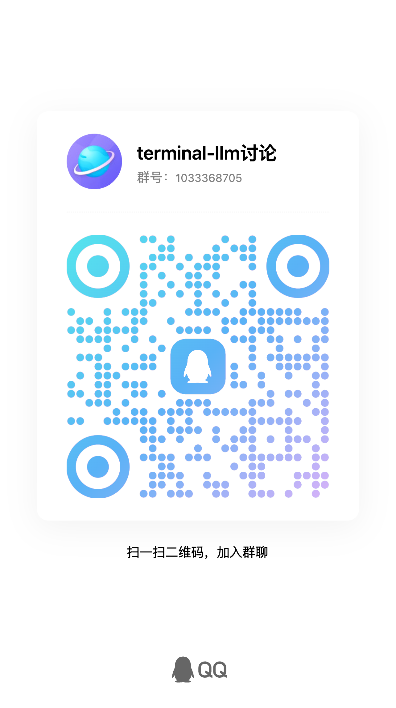

# terminal LLM

一个基于deepseek R1 api的终端辅助工具，使用openai兼容接口，提供便捷的命令行交互和上下文感知功能, 目标是命令行版本的cursor, windsurf。

## 使用场景
一个askgpt后边可以用多个@，混合构成上下文, 可以一边使用网址，同时加入文件内容，不必带""号    
```bash

# 修改代码的bug,会生成一个diff, 看你要不要使用patch
askgpt @edit @main.py 找到其中可能的bug，并加以修复

# 分析剪贴板内容
askgpt 解释这段代码：@clipboard @tree

#命令建议
askgpt @cmd 找到2小时前的所有文件, 并全部删除

# 附加当前目录结构
askgpt "@tree，请分析主要模块"

# 附加当前目录结构, 包括子目录
askgpt "@treefull，请分析主要模块"

# 嵌入文件内容
askgpt "请优化这个配置文件：@config/settings.yaml"

# 访问网页
askgpt @https://tree-sitter.github.io/tree-sitter/using-parsers/1-getting-started.html 归纳这个文档

# 阅读新闻, 会用readability工具提取正文, 需要配置了浏览器转发，下边有教程   
askgpt @readhttps://www.guancha.cn/internation/2025_02_08_764448.shtml 总结新闻

# 嵌入常用提示词, 文件放到在prompts/目录
askgpt @advice #这个提示词是让gpt提供修改建议

#灵活引入提示词块，提供文件，完成修改目录, 同时将剪贴版里边的片段引入   
askgpt @advice @llm_query.py @clipboard  修复其中可能的bug   
```

## 功能特性

- **代码文件分析**：替代view, vim, 用大模型分析本地源代码文件, 提供代码修改建议    
- **上下文集成**：
  - 剪贴板内容自动读取 (`@clipboard`)
  - 目录结构查看 (`@tree`/`@treefull`)
  - 文件内容嵌入 (`@文件路径`)
  - 网页内容嵌入 (`@http://example.com`)
  - 常用prompt引用 (`@advice`...)
  - 命令行建议 (`@cmd`)
  - 代码编辑 (`@edit`)
- **网页内容转换**：内置Web服务提供HTML转Markdown
  - 浏览器扩展集成支持, 绕过cloudflare干扰
  - 自动内容提取与格式转换
- **Obsidian支持** markdown保存历史查询到指定目录
- **代理支持**：完善的HTTP代理配置检测
- **多个模型切换** 在本机ollama 14b,32b小模型, 远程r1全量模型之间切换
- **流式响应**：实时显示API响应内容

## 安装与配置

1. **克隆仓库**
```bash
git clone https://github.com/maliubiao/terminal-llm
cd terminal-llm
```

2. **设置虚拟环境**
```bash
uv sync #uv python list; uv python install 某个版本的python, 3.12及以上
source .venv/bin/activate
```

3. **环境变量配置**
```bash
# 在shell配置文件中添加 (~/.bashrc 或 ~/.zshrc)
export GPT_PATH="/path/to/terminal-llm"
export GPT_KEY="your-api-key"
export GPT_MODEL="your-model"
export GPT_BASE_URL="https://api.example.com/v1"  # OpenAI兼容API地址
source $GPT_PATH/env.sh #zsh, bash支持@后补全
```

### R1 api提供商
[硅基流动](https://cloud.siliconflow.cn/i/BofVjNGq) 提供高性能API服务，注册即送2000万token，运行在华为昇腾全国产化平台上，安全可靠。  
附教程，[硅基云API使用教程](https://docs.siliconflow.cn/usercases/use-siliconcloud-in-chatbox)  


## 使用指南

### 基本命令

**分析源代码文件**
```bash
explaingpt path/to/file.py
# 使用自定义提示模板
explaingpt file.py prompts/custom-prompt.txt
```

**直接提问**

```bash
askgpt "如何实现快速排序算法？"
```

**模型切换**

```bash
#同目录下创建model.json, 用listgpt检查
➜  terminal-llm git:(main) ✗ listgpt 
14b: deepseek-r1:14b
➜  terminal-llm :(main) ✗ usegpt 14b
成功设置GPT环境变量：
  GPT_KEY: olla****
  GPT_BASE_URL: http://192.168.40.116:11434/v1
  GPT_MODEL: deepseek-r1:14b
```
```json
{
    "14b": {
        "key": "ollama",
        "base_url": "http://192.168.40.116:11434/v1",
        "model_name": "r1-qwen-14b:latest"
    }

}
```

### 高级功能

**网页内容转换服务**
```bash
# 启动转换服务器（默认端口8000), 用https://github.com/microsoft/markitdown实现
# 支持--addr, --port, 需要在插件option里也改
python server/server.py

# 调用转换接口（需配合浏览器扩展使用），server/plugin加载到浏览器
curl "http://localhost:8000/convert?url=当前页面URL"

# Firefox Readability新闻提取, 前面的server在收到is_news=True参数时，会查询这个, 端口3000, package.json中可改    
cd node; npm install; npm start
```


### 提示词模板

在`prompts/`目录中创建自定义模板, 请复制参考现有的文件：
```txt
请分析以下Python代码：

主要任务：
1. 解释核心功能
2. 找出潜在bug
3. 提出优化建议

文件名: {path}
{pager}
\```
{code}
\```
```

## 环境变量

| 变量名         | 说明                          |
|---------------|-----------------------------|
| `GPT_PATH`    | 项目根目录路径                   |
| `GPT_KEY`     | OpenAI API密钥          |
| `GPT_BASE_URL`| API基础地址 (默认Groq官方端点)   |
| `GPT_KEY`     | API KEY    |

## 目录结构

```
groq/
├── bin/              # 工具脚本
├── server/           # 网页转换服务
│   └── server.py     # 转换服务器主程序
├── prompts/          # 提示词模板
├── logs/             # 运行日志
├── llm_query.py      # 核心处理逻辑
├── env.sh            # 环境配置脚本
└── pyproject.toml    # 项目依赖配置
```


## 注意事项

1. **依赖工具**：
   - 安装[glow](https://github.com/charmbracelet/glow)用于Markdown渲染
   - 安装`tree`命令查看目录结构
   - Windows用户需要安装pywin32

2. **代理配置**：
   自动检测`http_proxy`/`https_proxy`环境变量

3. **文件分块**：
   大文件自动分块处理（默认32k字符/块）

4. **网页转换服务依赖**：
   - 需要安装Chrome浏览器扩展配合使用
   - 确保8000端口未被占用, 或者在插件配置option页改地址
   - 转换服务仅接受本地连接


## terminal-llm群


## 许可证

MIT License © 2024 maliubiao


